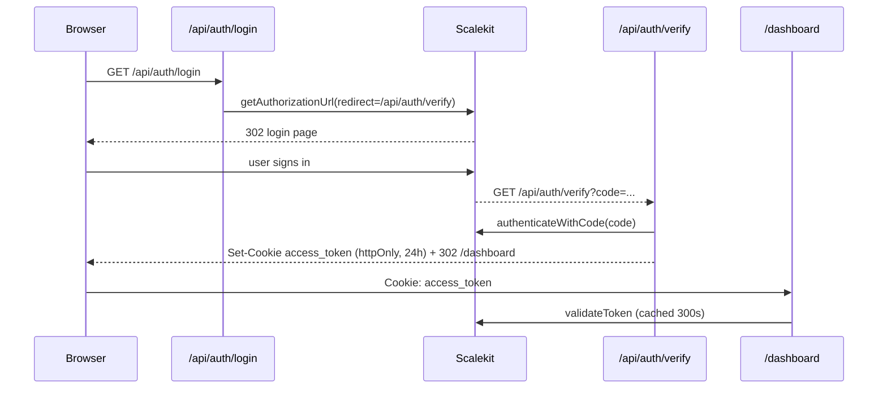

# Authentication

Scalekit B2B OAuth with a signed session cached in Redis and stored as an `httpOnly` cookie.

## Flow

## Endpoints

| Endpoint               | File                               | Behavior                                                                                                                                                                   |
| ---------------------- | ---------------------------------- | -------------------------------------------------------------------------------------------------------------------------------------------------------------------------- |
| `GET /api/auth/login`  | `src/app/api/auth/login/route.ts`  | Public. Builds Scalekit authorize URL with `redirect_uri=${ENV.API_URI}/api/auth/verify`. `302`, else `400/500`.                                                           |
| `GET /api/auth/verify` | `src/app/api/auth/verify/route.ts` | Public callback. Exchanges `code`, sets `access_token` (`httpOnly`, `maxAge` 24h, `secure` in prod, `path: /`), `302` to `${ENV.API_URI}/dashboard`. `400` without `code`. |
| `GET /api/auth/logout` | `src/app/api/auth/logout/route.ts` | Clears `Cache.delete(session:<sha256>)`, deletes the cookie, `302` to `ENV.API_URI`.                                                                                       |

## Session resolution

- `getUserSession()` (`src/lib/getUserSession.ts`): reads the cookie via `next/headers`, checks `Cache.get(session:<hashToken>)` (TTL 300s), else `scalekit.validateToken(token)` → `scalekit.user.getUser(sub)` → caches. Returns `SessionUser | null`; never throws.
- `requireOwner()` (`src/lib/auth.ts:16`): maps `session.user.id → ownerId`, `session.user.email → email`. Returns `null` when unauthenticated. Dashboard/API callers translate `null` → `401 { success: false, message: "Unauthorized" }` or redirect to `/api/auth/login`.
- `getScalekit()` (`src/lib/scalekit.ts`): singleton built from `SCALEKIT_ENVIRONMENT_URL`, `CLIENT_ID`, `CLIENT_SECRET`.

## Route protection

Two layers, both live:

1. **Proxy** — `src/proxy.ts` (Next 16 renamed `middleware.ts` → `proxy.ts`). `proxy()` + `config.matcher: ["/dashboard/:path*"]` calls `getUserSession()`; redirects to `ENV.API_URI` on null/error.
2. **Inline** — dashboard layouts/pages call `requireOwner()` again (defense in depth for direct renders / prefetches).

Public routes (`/`, `/api/chat`, `/api/chat/config`) intentionally skip both.

## Owner isolation

- `ownerId` always comes from the session, never from the request body/query.
- Every owner-scoped query includes `{ ownerId }` (chatbots, documents, conversations, analytics, account).
- Bot responses mask secrets: `serializeBot()` exposes `•••• + last4` only (see `src/lib/chatbots.ts`).
- Notion tokens are `select: false` in `Owner` and explicitly selected only in the document-ingest path.

## What to check when auth breaks

- `NEXT_PUBLIC_API_URI` must exactly match the Scalekit redirect URI (including scheme/port).
- Missing `SCALEKIT_*` vars: `env.ts` logs but does not throw — login returns `400/500` downstream.
- Cookie flags: `httpOnly` is always set; `secure` only in production, so local HTTP still works.
- Stale Redis session: logout deletes `session:<hash>`; TTL is 300s otherwise.
